# markdown-it-mermaid-pro

[](https://travis-ci.org/searKing/markdown-it-mermaid-pro)
[](https://www.npmjs.org/package/markdown-it-mermaid-pro)
[](https://coveralls.io/r/searKing/markdown-it-mermaid-pro?branch=master)

&lt;svg> tag plugin for [markdown-it](https://github.com/markdown-it/markdown-it) markdown parser. Generation of diagrams, flowcharts, gants and sequences from text.


__v2.+ requires `markdown-it` v5.+, see changelog.__


Markup uses the same conditions as CommonMark [emphasis](http://spec.commonmark.org/0.15/#emphasis-and-strong-emphasis).


## Install

node.js, browser:

```bash
npm install markdown-it-mermaid-pro --save
bower install markdown-it-mermaid-pro --save
```

## Use

```js
var md = require('markdown-it')()
            .use(require('markdown-it-mermaid-pro'));

md.render('
graph TD
A[Christmas] -->|Get money| B(Go shopping)
B --> C{Let me think}
C -->|One| D[Laptop]
C -->|Two| E[iPhone]
C -->|Three| F[Car]
') // => '<svg>......</svg>'
```


_Differences in browser._ If you load script directly into the page, without
package system, module will add itself globally as `window.markdownitMermaid`.


## License

[MIT](https://github.com/searKing/markdown-it-mermaid-pro/blob/master/LICENSE)

